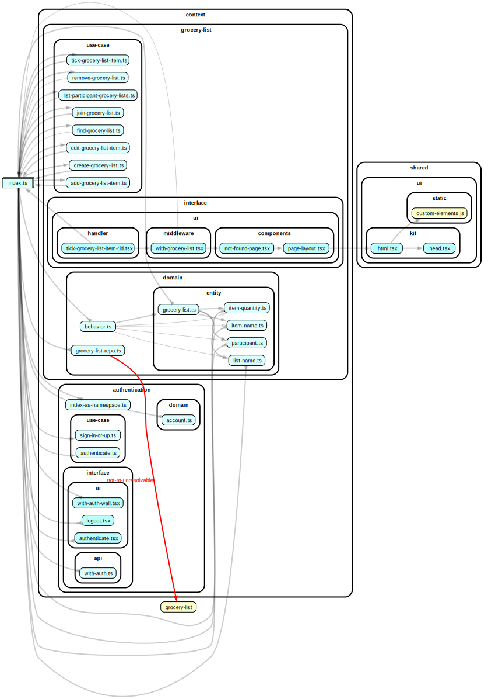

# Server-First Projects

This is a collection of server-side jsx projects. The structure:

## Commands

```sh
# check TS
npm run check # or ./check-ts

# start grocery-list:
cd grocery-list
npx tsx --watch --tsconfig ./tsconfig.json ./interface/server.ts

# generate a graph of dependencies for a single file:
./graph-of context/grocery-list/use-case/join-grocery-list.ts
./graph-of context/grocery-list/interface/ui/handler/tick-grocery-list-item-:id.tsx
```

<details>
  <summary>
    grocery-list/interface/ui/handler/join-grocery-list-:id
  </summary>


</details>

<details>
<summary>
grocery-list/interface/ui/handler/tick-grocery-item-list-:id
</summary>



</details>

```txt
server-first/
├── library/
│   ├── std/
│   ├── h3/  -> facade of h3 to define std/web/server-handler in the h3 world.
│   ├── json-patch/ -> collection of json-patch tools exposed in a unified stable API.
│   └── jsx-server/ -> my implementation of server-side jsx that TS can understand.
└── [project: grocery-list]/
    ├── context/
    │   └── [context-name]/
    │       ├── domain/[domain-name]/ -> entities, repo specs, synchronous behavior logic.
    │       ├── use-case/ -> use-cases requiring infrastructure as dependency
    │       └── interface/
    │           ├── api/
    │           └── ui/    -> there goes the React/SolidJS/Vue/… components
    ├── infra/
    │   └── repository-infra.[file-system|in-memory|sql].ts
    ├── interface/
    │   ├── api/   -> regroups the contexts’ APIs.
    │   ├── ui/    -> regroups the contexts’ UIs.
    │   └── server.ts -> exposes api/router.ts and ui/router.ts in a single server.
    └── shared/
        └── ui/
            ├── kit/    -> design system.
            └── static/ -> static assets like images, CSS, etc.
```
